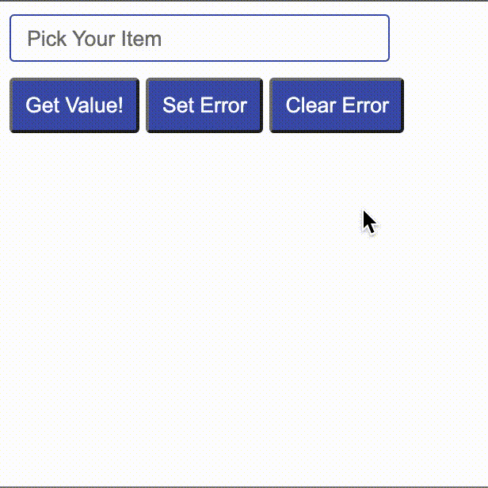

# Search-Select

SearchSelect: A searchable dropdown library.

### Previews

[Example for v1](examples/example.html)


[Example for v2](examples/example.v2.html)




## Installation and usage

### Installation

Download search-select using below methods.

1. Git Release

```sh
https://github.com/workindia/search-select/releases
```

2. CDN

```sh
https://cdn.jsdelivr.net/gh/workindia/search-select@1.0.0/search-select.js
```

3. NPM

```sh
npm i search-select-js
```

### Usage

Add search-select to your page:
```html
<link rel="stylesheet" href="search-select.css">
<script src="search-select.js"></script>
```

You can create a hidden input with class `Search-Select--Hidden-Input` which will be used to create a search-select dropdown:
```html
<input id="dropdown-input"
    name="dropdown-input"
    class="Search-Select--Hidden-Input"
    placeholder="Pick Your Item"
    data-search-placeholder="Search Your Item"
    hidden/>
```

To initialize search-select dropdown, add following to your javascript:
```javascript
const searchSelectDropdown = new SearchSelect('#dropdown-input', {
    data: ['item1', 'item2', 'item3', 'item4'],
    filter: SearchSelect.FILTER_CONTAINS,
    sort: undefined,
    inputClass: 'form-control mobile-field',
    maxOpenEntries: 9,
    searchPosition: 'top',
    onInputClickCallback: function(ev) { console.log('Input Clicked') },
    onInputKeyDownCallback: function(ev) { console.log('Input Key Down') },
});
```

Search-select will set selected value to the hidden input (`#dropdown-input`). Selected value can be retrieved from the hidden input. Change event listener can be applied to the hidden input to watch any change in the value.
```javascript
// Get selected value
const selectedValue = document.getElementById('dropdown-input').value;

// Add change listner
document.getElementById('dropdown-input').addEventListner('change', function(ev) { console.log('Value changed'); })
```

## Documentation
### Configuration Parameters
- `data` - Input data for dropdown
- `filter` - Filter criteria for dropdown search
- `sort` - Sort criteria for dropdown items
- `inputClass` - Custom class to be applied to the visible input
- `maxOpenEntries` - Maximum number of items visible when dropdown is open
- `searchPosition` - Position of search bar input
- `dropdownPosition` - Position of dropdown
- `onInputClickCallback` - Event called when search-select input is clicked
- `onInputKeyDownCallback` - Event called when a key is pressed in search bar

Parameters added v2 onwards
- `hideSeparateSearchInput` - If true, given input field will be used as search box as well as showing value
- `onInputBlurCallback` - Callback function runs when input box is out of focus
- `noMatchText` - Text (HTML) to be shown if none of the options match
- `onErrorClass`: - Error class to be set on  input field has error

### Methods
- `openDropdown(focus)` - Open dropdown. Pass `focus=true` if to set focus on search bar
- `closeDropdown()` - Close dropdown.
- `setData(data)` - Set dropdown list data.

Methods added v2 onwards
- `setValue(val)` - Set the value of search-select. The value must be present in the data. Returns true if set correctly, false otherwise.
- `setClonedInput(val, placeholder)` - Set the display value and placeholder of visible input.
- `focusClonedInput()` - Focus on visible on input
- `setError()` - Set error class to input
- `clearError()` - Clear error class from input


# Contributing
Feel like contributing? That's awesome! We have a [contributing guide](CONTRIBUTING.md) to help you.


## License

[](LICENSE)